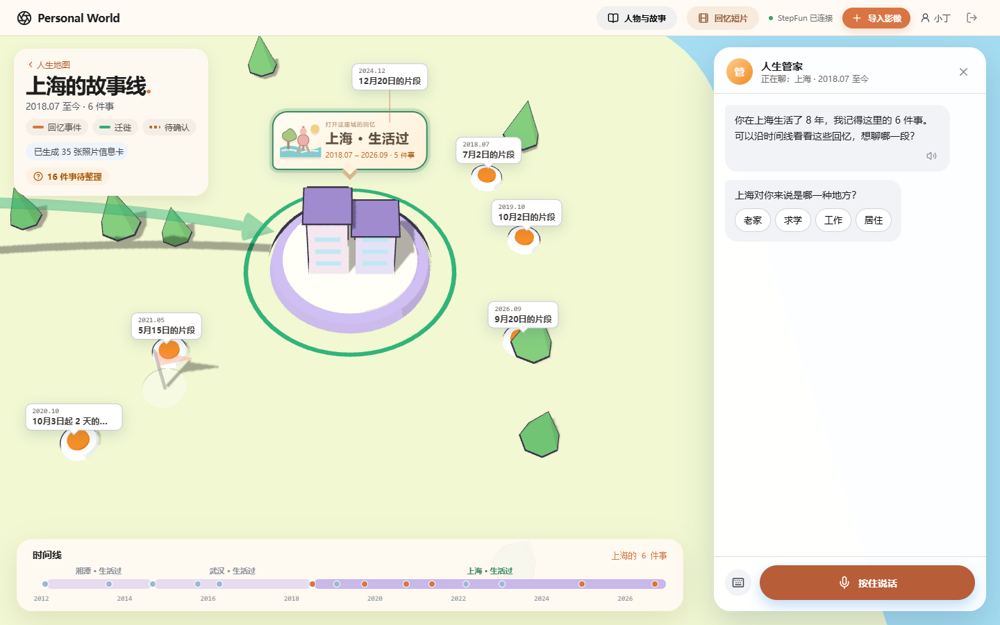
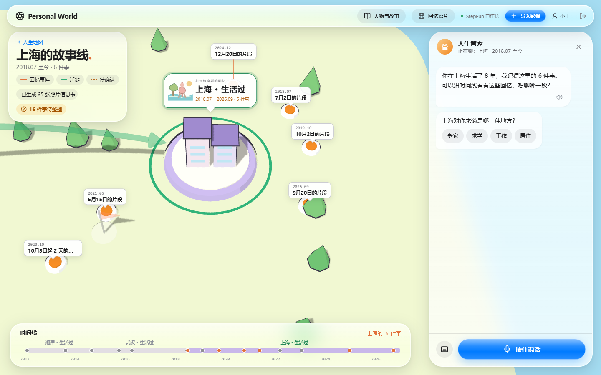

# liquid-glass 对比测试（2026-09-28）

同一任务：人生地图 + 人生管家的界面样式。

- **不用 skill**：改造前的样式表（提交 `1e113e4` 的 `src/styles.css` + `src/app.css`）。
- **用 skill**：按 [SKILL.md](../../SKILL.md) 改造后的样式表。

评分脚本是 [`audit.mjs`](../../audit.mjs)，按层叠后的结果判定（同一选择器后面的规则覆盖前面的）。逐项结果见 [results.json](results.json)。

| 规则 | 不用 skill | 用 skill |
|---|---|---|
| 玻璃材质变量（tokens） | ✗ | ✓ |
| 导航与控件层使用玻璃 | ✗ | ✓ |
| 内容层（地图标签、照片）不用玻璃 | ✓ | ✓ |
| `backdrop-filter` 带 `-webkit-` 前缀 | ✓ | ✓ |
| 降低透明度时改为不透明 | ✗ | ✓ |
| 增强对比度时显示边框 | ✗ | ✓ |
| 玻璃上不叠玻璃 | ✓ | ✓ |
| 悬停不位移 | ✓ | ✓ |
| 照片上方的控件用 clear 变体 | ✗ | ✓ |
| 次要文字对白底对比度 ≥ 4.5 | ✓ | ✓ |
| **合计** | **5 / 10** | **10 / 10** |

## 核对失败样例

第一版脚本逐条规则判定，把两处实际没问题的地方判成了违规，已改为按层叠结果判定并加了测试：

- `.modal-backdrop` 第一条规则缺少 `-webkit-backdrop-filter`，但同一文件后面的规则带了前缀。
- `.button:active{transform:scale(.97)}` 被后面的 `transform:none` 取消了。

余下 5 项逐一核对，确实不符合：

- 旧样式没有玻璃变量。
- 顶栏和标题卡只有模糊，没有边缘高光和光泽。
- 没有 `prefers-reduced-transparency` 和 `prefers-contrast` 的处理。
- 照片查看器的按钮是普通半透明方块。

## 截图

用 `node tests/ui-shots.mjs <目录>` 生成，照片是测试夹具，不是用户照片。

| 不用 skill | 用 skill |
|---|---|
|  |  |
