<div align="center">
  
  <h1>Personal World · 人生地图</h1>
  <p><strong>对未来相册的一次探索：让相册记录人生，也能和你对话。</strong></p>
  <p>未来的相册不该只是存放照片的地方。它应该记录一个人生活里的所有信息，让你走回过去，甚至让现在的你和过去的你说上话。这是朝那个方向迈出的第一步。</p>
  <p>
    <a href="#项目说明">项目说明</a> ·
    <a href="#功能与依赖">功能与依赖</a> ·
    <a href="#快速开始">快速开始</a> ·
    <a href="#部署说明本地算力agent-与-skills">部署说明</a> ·
    <a href="#技术栈">技术栈</a> ·
    <a href="#文档">文档</a>
  </p>
  <p>
    
    
    
    
    
    
    
  </p>
</div>

<p align="center">
  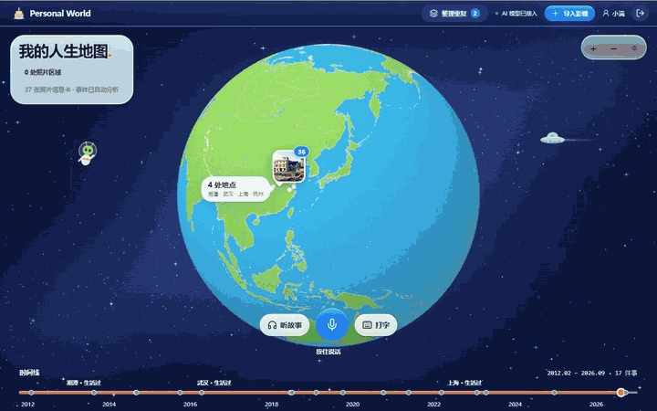
</p>

<p align="center"><sub>演示用 AI 生成的虚构照片录制，没有任何真实的私人照片。地图、时间线、缩放与三维重建都是真实运行；语音识别、管家的回答和时空场景的分段为固定脚本（保证录制可重复）。</sub></p>

## 项目说明

### 我们在探索什么

**相册的终极形态是什么？**

今天的相册，本质上是一个按时间或地点排列照片的抽屉：看得到"哪天在哪"，看不到"发生了什么"；能翻，但不能问；照片之外的一切——当时和谁在一起、为什么去、那天的天气、后来发生了什么——都留在你的脑子里，时间一长就模糊了。

我们认为，未来的相册应该走向另一个方向：

1. **记录人生的全部信息**，不只是照片。事件、人物与关系、地点、声音、你事后补充的记忆，都属于同一份人生记录。
2. **可以走进去**。回看不是翻页，而是回到那个地方、那个时间的空间里。
3. **可以对话**。你能向自己的人生提问；再往前一步，**现在的你可以和过去的你对话**。

这是一次对未来的摸索，不是成品。下面把愿景和现在实际做到的分开写：

| 愿景 | 现在已经做到 | 还没有做到 |
| --- | --- | --- |
| **记录人生的全部信息** | 照片的时间、GPS、画面内容和可读文字；自动整理成事件；人物与关系由你确认；你的补充记忆与照片一起保存 | 视频内容理解；声音、文字消息等其他记录 |
| **走回过去的地方** | 卡通地球一路放大到街区；4D 时空场景：同一地点分时段，逐层标出证据，单张照片重建成三维浮雕，多张照片合成场景（实验性） | 可 360° 环绕的真实重建（需要环绕拍摄的视频或多角度照片） |
| **向人生提问** | 人生管家：用你的事件、照片信息卡和人物故事回答，推断的内容单独标出；「听故事」边放照片边讲，并经独立复核 | — |
| **现在的你和过去的你对话** | 打好了地基：**事实与推断严格分开、每条推断有依据、生成的话不会变成"记忆"** | **尚未实现**，是下一步的方向 |

第四行是我们最看重的一行。如果要让"过去的你"开口，最大的风险是它**编造你没有经历过的事**——一个会捏造回忆的过去的自己，比没有更糟。所以项目从第一天起就把"不编造"当成底线：信息卡把程序读到的事实和模型的推断分开，推断带依据和置信度、用虚线标出；没有证据的时空层写"无依据"，不在两个时段之间插值；模型生成的旁白不能回写成事实，只有你确认过的才算数。

人生记录是最私密的数据，所以**照片、记忆和账户都存在你自己电脑的硬盘上**，重活（三维重建、人脸识别、视频合成）也在本机算力上完成。

### 它现在怎么工作

先确定"发生了什么事"，再从事件里分离出时间线和空间线：地点的分量来自发生的事，而不是照片的数量。

| 记录 | 理解 | 回看 |
| :--- | :--- | :--- |
| 导入照片、视频和截图，读取时间与 GPS，自动整理成事件 | 逐张生成信息卡、认出人物、串起故事；**事实与推断分开，每条推断都标来源** | 卡通地球与街区地图、语音管家、边看边讲、回忆短片、4D 时空场景 |

### 核心亮点

- **一颗连续缩放的卡通世界，作为回看的入口。** 地球始终是球体，滚轮一路放大到街区，中间没有切换和跳变。地面不是卫星图，而是按 OpenStreetMap 的真实海岸、河流、道路和建筑轮廓，在本机生成的卡通世界：树木、红蓝屋顶、斑马线、专属地标模型。
- **会操作地图的人生管家。** 不是聊天框，而是一个 agent：按住话筒说话，它按语义找照片、定位到拍摄的地方、讲一段经历并配幻灯片、拨动时间线，或打开人物、时空场景和回忆短片。模型只返回 `actions`，动作由服务端校验后才在界面执行。
- **不编造。** 信息卡把程序读到的事实（时间、GPS、尺寸）和模型看到的画面分开；每条推断带依据和置信度，虚线表示推断；生成的旁白不会回写成事实；没有证据的时空层就写"无依据"，不在两个时段之间插值。
- **本机算力做重活。** 照片在本机 GPU 上重建成三维浮雕（ComfyUI + Depth Anything 3，DGX Spark 上单张约 1.5 秒），人脸识别、回忆短片合成、地图数据构建都在本机完成；照片和记忆按账户存在你自己电脑的硬盘上。
- **每个 AI 环节都有 Skill。** 16 个 Skill（9 个运行时、7 个开发）都是可读、可测、可对比的 Markdown，各有专门测试和"用 / 不用 skill"的对比评估。

### 技术实现方案与架构

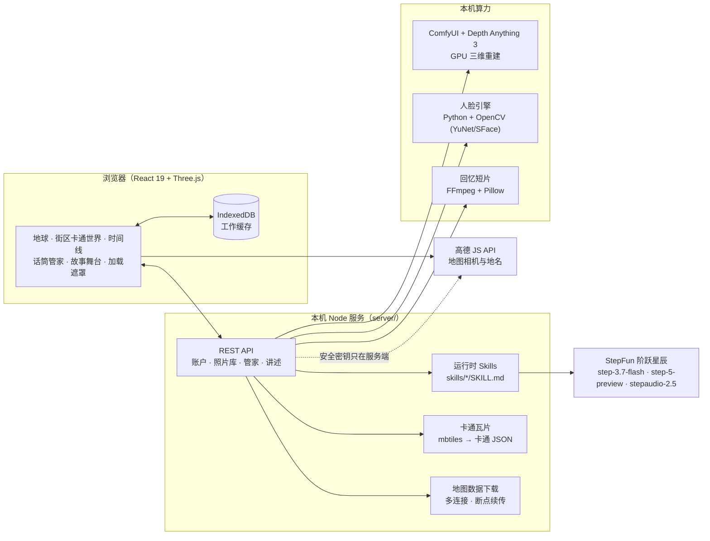

1. **先事件，后时空。** 同一天、6 小时内、50 km 内的照片合成一件事；离开常住地的连续多天合并为一次旅行。定位按"照片自带 GPS / 元数据 → 画面里的地标、路牌、店名 → 与其他照片对比"的顺序逐级补全，每个地点标明来源和精度。
2. **分层的 AI 流水线。** 信息卡 → 事件分析 → 跨事件故事发现 → 独立复核，每一层的输入输出都是结构化 JSON。写作和复核由不同请求完成，最后还有程序做证据校验（`server/photoCard.mjs`、`server/storytelling.mjs`、`server/privacy.mjs`），模型说错时程序兜底。
3. **卡通世界在本机构建。** Planetiler 把 OSM 构建成 mbtiles；服务端把每个瓦片一次性转成卡通 JSON 并存盘（`server/cartoonTiles.mjs`）；浏览器里的 Three.js 只画不算。高德只提供相机与缩放，画面由自己的 Three.js 场景叠在上面。
4. **管家是 agent，不是聊天框。** `/api/butler` 收到照片信息卡索引和界面状态，返回文字与 `actions`；`server/butler.mjs` 校验动作，`App.tsx` 执行，人物与故事、时空场景、回忆短片都由管家在对话中打开。
5. **账户数据在本机。** 照片和记忆存在 `server/data/accounts/<账户>/`，浏览器 IndexedDB 只是缓存，清除后登录自动恢复；密钥只放 `.env`，由服务端读取。

### 优化方案

- **减少送给模型的数据。** 信息卡的图片缩放到最长边 2560 px；事件分析最多发 6 张预览图；管家只收文字和信息卡索引，不收图片；同一批照片的分段只用信息卡文字。
- **并发与流水线。** 信息卡两张并行、事件逐件分析、失败自动暂停并可从断点继续；界面在分析期间保持可用，进度显示在后台进度卡里。
- **用评估而不是感觉调 Skill。** 每个 Skill 的规则由真实模型的对比测试确定：photo-card **44/45 vs 23/45**、photo-context **48/48 vs 40/48**、photo-cull **36/36 vs 34/36**（用 / 不用 skill），见各 Skill 的 `evals/`。评分脚本先核对失败样例，避免误判。
- **本机模型的参数取舍。** 三维重建选 `resolution=1008`、`decimation=2`、`discontinuity_threshold=0.12`、开启天空遮罩：再高的分辨率显存和时间线性增加而细节提升有限，GLB 约 5–10 MB，详见 [浮雕管线](skills/spacetime-modeling/references/relief-pipeline.md)。
- **管家回答提速 3 倍。** 一次管家请求的输出有 600–1700 个 token，而真正的回答只有几十个字，绝大部分时间是模型的"思考"，网络往返只有约 0.1 秒。交互式的管家请求用 `reasoning_effort=low`：12 个问题的实测，中位耗时从 15.3 秒降到 5.0 秒，回答和动作（如"海边的照片"触发找照片）一致；后台任务保持默认强度。
- **生产模式。** `npm start` 用构建好的成品，首屏更快（数据见"快速开始"）；地球与街区拖动时帧率 76–96 fps（NVIDIA GB10 上实测）。
- **地图数据又快又稳。** 558 MB 的地图档案用 4 连接分块下载、断点续传、SHA-256 校验，页面显示实时速度和剩余时间；瓦片一次构建后存盘，浏览器再缓存一份。

## 功能

### 一颗连续缩放的卡通世界

地球始终是球体，滚轮或双指一路放大到街区；街区地图同样按球面弯曲。地图数据在本机构建并持久化，草地、水面、屋顶等贴图已随仓库提供（`public/world-assets/textures/`），运行时不需要任何图像模型。

### 故事线与时间线

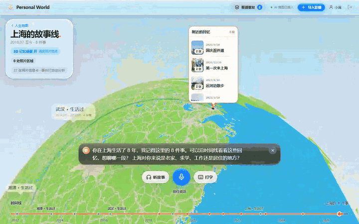

点击地图上的地点，出现这个地方的故事线：照片、日期和事件标题合在同一张卡片里，常去地点的多次回忆分行展示。停留超过半年且有 3 件以上事的城市成为人生据点，按迁徙顺序连成空间线。底部时间线可拖动、点击和键盘操作。

### 会操作地图的人生管家


地图上只有一个话筒（也可以打字）。按住说话时字幕实时出现；回答以字幕显示并朗读，**推断的内容带虚线下划线**。「听故事」会自动选题、独立重看照片、写作，再经独立复核和证据校验，边放照片边讲。

### 4D 时空场景：同一个地方，不同的时候

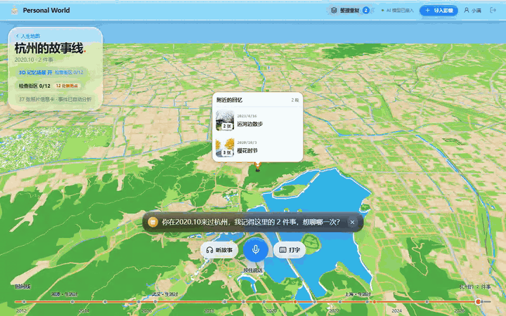

同一地点的照片按有依据的时间片分段；季节、时段、天气、建筑、声音、交通逐层标出 **照片可见 / 推断 / 无依据**。时段里的任何一张照片都可以在本机 GPU 上用 Depth Anything 3 重建成三维浮雕，在拍照的位置轻轻晃动就能看到视差。**一张照片没法 360° 环绕**——背面没有信息；多张视角重叠的照片可以合成一个场景（实验性，[4D 建模 skill](skills/spacetime-modeling/SKILL.md)）。

### 还有这些

- **照片信息卡**：程序读到的事实与模型看到的画面、可读文字、带依据的线索、地标和待确认问题分开显示。
- **人物与故事**：人脸分组，由你确认称呼和关系，绑定到稳定的人物 ID；名字或关系变化后，相关经历自动重新理解。
- **回忆短片**：自动选片、字幕和镜头编排，用本机 FFmpeg 合成 MP4。
- **整理重复照片**：相似的照片叠在一起，推荐留下最好的几张，你确认后才删除。
- **隐私**：号码等敏感文字在你同意隐私声明后才原样显示，否则遮挡。

<details>
<summary><strong>专属地标模型</strong> · 拱墅运河体育公园、城北万象城、浙江环球中心等 7 处</summary>

<table>
  <tr>
    <td>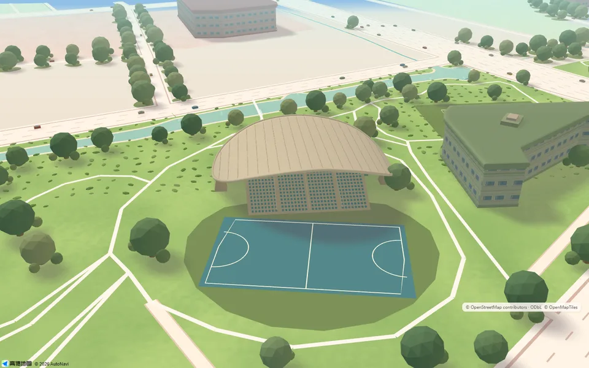</td>
    <td>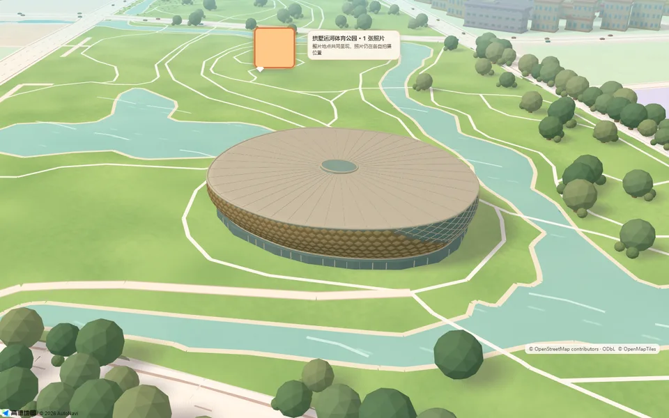</td>
  </tr>
  <tr><td align="center">拱墅运河体育公园 · 杭州伞</td><td align="center">玉琮馆</td></tr>
  <tr>
    <td>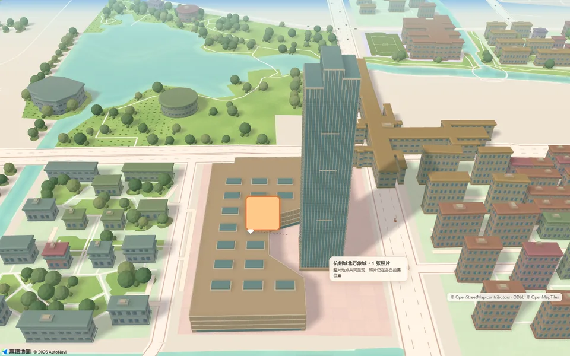</td>
    <td>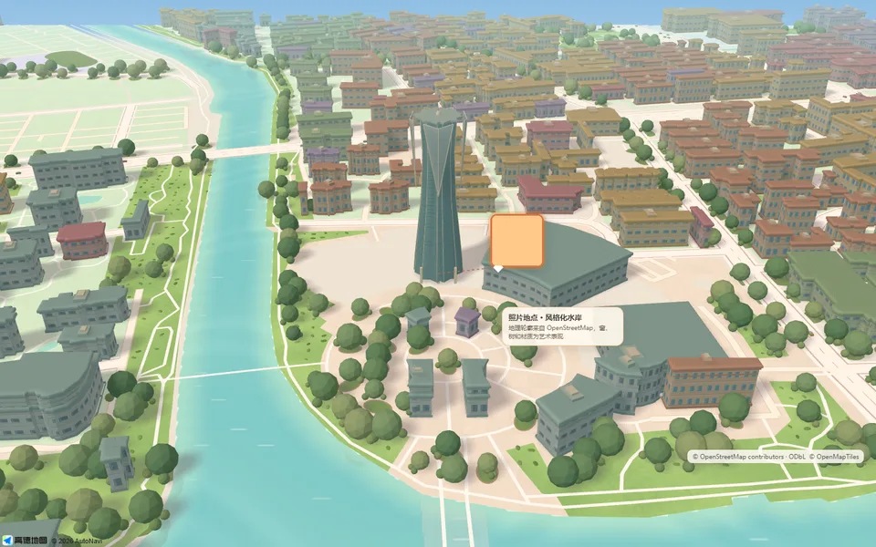</td>
  </tr>
  <tr><td align="center">杭州城北万象城与润珹置地中心</td><td align="center">浙江环球中心</td></tr>
</table>

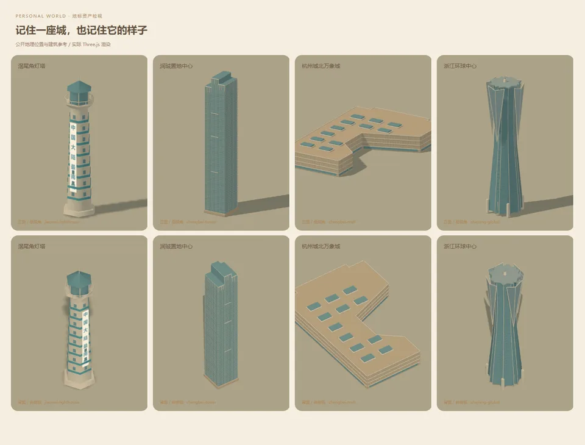

这些是按真实建筑轮廓和公开资料手工制作的程序化模型，其余地点使用通用建筑。清单和边界见[专属地标资产清单](docs/LANDMARK_ASSET_INVENTORY_2026-09-28.md)。

</details>

<details>
<summary><strong>更多画面</strong> · 地球总览、街区、故事线、管家与时空场景</summary>

<table>
  <tr>
    <td>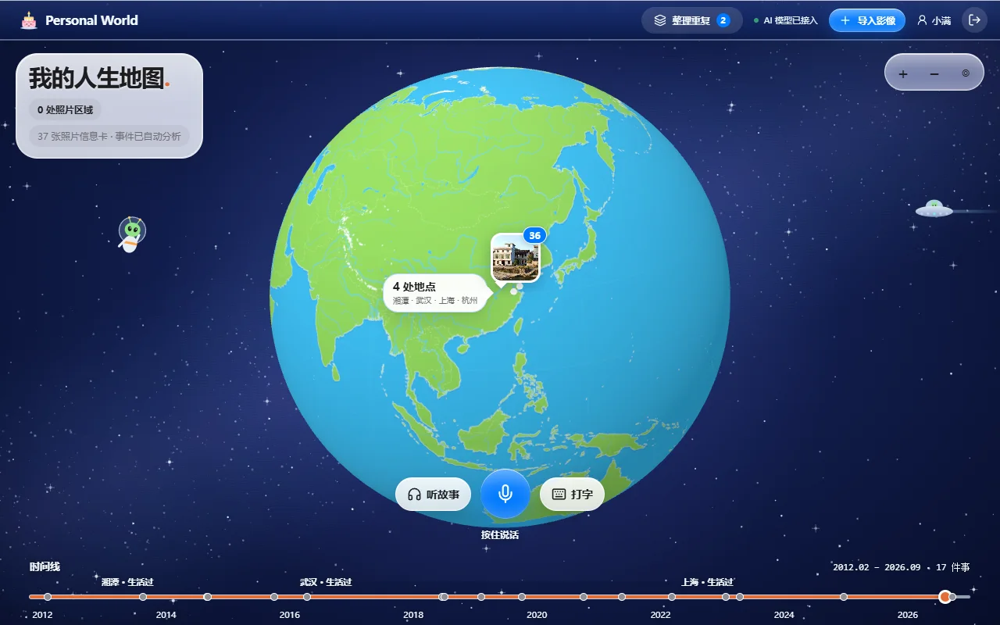</td>
    <td>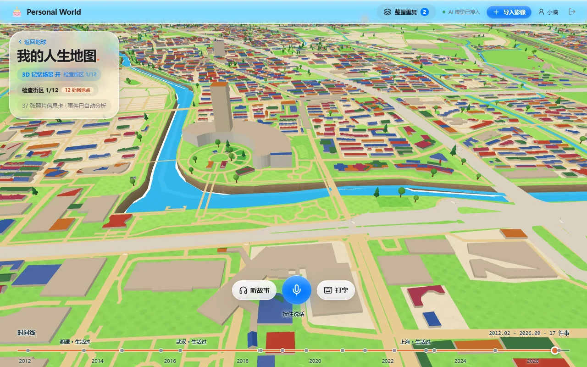</td>
  </tr>
  <tr><td align="center">地球总览：照片按位置成组</td><td align="center">街区：真实建筑轮廓与树木</td></tr>
  <tr>
    <td>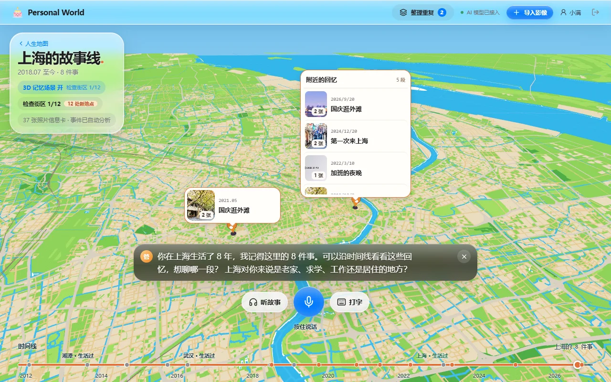</td>
    <td>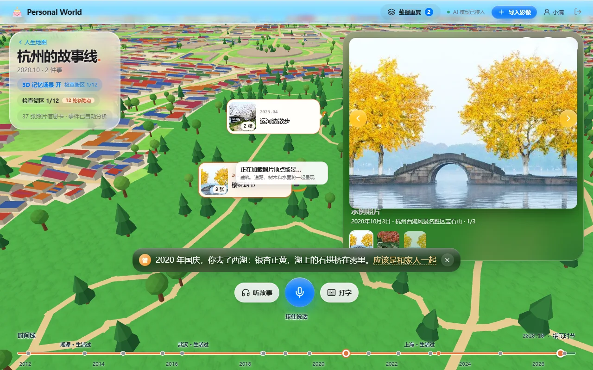</td>
  </tr>
  <tr><td align="center">上海的故事线</td><td align="center">人生管家：字幕、推断标记、照片上台</td></tr>
  <tr>
    <td>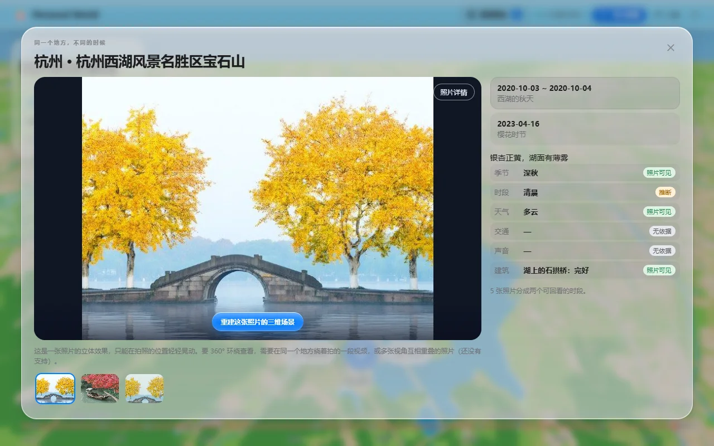</td>
    <td>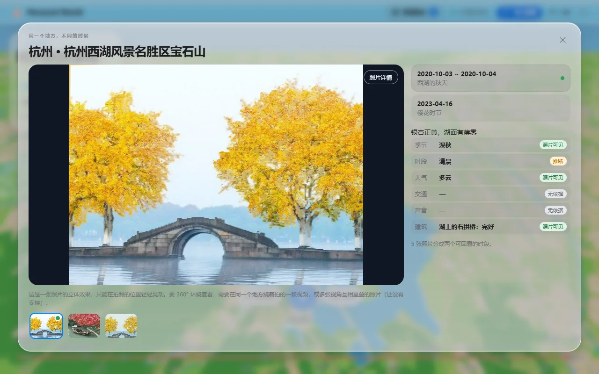</td>
  </tr>
  <tr><td align="center">时空场景：时间片与逐层证据</td><td align="center">同一张照片的三维浮雕</td></tr>
</table>

</details>

## 功能与依赖

**完整部署要求所有功能都可用**：下表每一行都是一个功能，右边是它需要的软件和配置。缺哪一项，对应的功能就不能用，启动前的环境检查（`npm run check`，`npm run dev` 会自动先跑一遍）会逐项指出并给出修复办法。

| 功能 | 依赖的软件 | 依赖的配置（`.env`） | 缺少时 |
| --- | --- | --- | --- |
| **网页与 API 服务**<br/>账户、照片库、时间线、地球 | Node.js ≥ 22.13（推荐 24，需要 `node:sqlite`）、`npm install` | — | 无法启动 |
| **照片信息卡、事件分析**<br/>逐张分析、事件整理、定位补全 | StepFun 模型 API | `STEPFUN_API_KEY`、`STEPFUN_BASE_URL`、`STEPFUN_MODEL`（需支持图片，如 `step-3.7-flash`） | 照片只能本地整理，不能自动分析 |
| **人生管家、语音提问、朗读** | StepFun 语音识别与合成（`stepaudio-2.5-asr` / `stepaudio-2.5-tts`）；浏览器麦克风 | 同上；远程访问必须用 HTTPS（`npm run dev:lan`） | 只能打字提问，不朗读 |
| **边看边讲、人物与故事的重理解** | StepFun 写作模型 | `STEPFUN_STORY_MODEL`（默认 `step-5-preview`，可选） | 用 `STEPFUN_MODEL` 写作 |
| **地图相机与缩放、照片 GPS 识别城市、地点搜索** | 高德开放平台"Web端(JS API)"Key；可访问 `webapi.amap.com` | `AMAP_JS_KEY`、`AMAP_JS_SECURITY_CODE`（安全密钥只由本机服务读取） | 地图退回卡通底板，不能识别城市 |
| **卡通世界的街区地图**<br/>海岸、河流、道路、建筑、树木 | 地图档案 `world-data/*.mbtiles`（约 558 MB，启动时自动下载）；`node:sqlite` | `WORLD_DATA_URL`（仅当清单里的文件没有下载链接） | 下载完成前地图不可用，页面显示进度 |
| **人物识别**<br/>人脸分组、稳定人物 ID | Python 3.12 + `numpy`、`opencv-python`、`Pillow`（`server/requirements-local.txt`）；人脸模型 YuNet + SFace（自动安装） | `FACE_PYTHON`、`FACE_MODELS_DIR`（可选） | 不能识别人物 |
| **回忆短片**<br/>选片、字幕、镜头编排、合成 MP4 | FFmpeg（含 libx264、aac）、Python 3.12 + Pillow、中文字体（Windows 微软雅黑 / Linux Noto Sans CJK / macOS 苹方） | `FFMPEG_PATH`、`MEMORY_FILM_PYTHON`、`MEMORY_FILM_FONT`（可选） | 不能生成短片 |
| **4D 时空场景：三维浮雕重建**<br/>单张照片重建、多张照片合成 | **NVIDIA GPU + CUDA**、ComfyUI（含 Depth Anything 3 节点）、模型 `depth_anything_3_mono_large.safetensors`（1.3 GB）和 `depth_anything_3_base.safetensors`（0.5 GB，多张合成场景用） | `COMFYUI_DIR`（启动服务时自动拉起）、`COMFY_URL`（默认 `http://127.0.0.1:8188`） | 只显示照片与各层证据，不能重建 |
| **构建新地区的地图档案**（只在自己扩地图时） | Java 21+（推荐 23）、`world-data/sources/planetiler.jar`、OSM 数据 | `JAVA_PATH` | 只能用现成的浙江、江苏档案 |
| **浏览器测试、录制演示**（开发用） | Google Chrome、Playwright | — | 不能跑 `test:smoke` 等 |

各系统的情况：**Linux** 在 DGX Spark（aarch64，CUDA 13）上逐项验证过；**Windows** 是项目最初的开发环境；**macOS** 的命令按其习惯写在下面，没有逐项验证过，三维重建需要 NVIDIA GPU，macOS 上不可用。所有路径和命令都不写死系统，缺什么由启动前检查指出。分析进度、地图数据下载进度都会显示在界面上：

- **地图数据、地图本身、照片库**没有准备好时，界面用一张进度卡盖住地图，逐项显示状态和进度条（地图数据显示已下载 MB、速度、剩余时间；出错时给出原因和"重试下载"按钮），**全部就绪后才打开地图**。
- **照片信息卡和事件分析**在后台进行，右上角的后台进度卡显示进度，不挡住地图；失败或暂停时给出原因和"继续分析"。
- Linux 桌面浏览器：高德的 JS API 会给所有 Linux 浏览器 2D 地图，2D 下无法绘制卡通世界。应用在 Linux 上自动让高德按 WebGL 浏览器处理，你不需要改任何浏览器设置；若高德仍进入 2D，界面会提示并退回卡通底板，而不是显示空白。

## 快速开始

```bash
git clone https://github.com/noeigenstate/PersonalWorld.git
cd PersonalWorld
npm install
cp .env.example .env      # Windows: copy .env.example .env；填入 StepFun 与高德密钥
npm run check             # 只检查，不改动：逐项报告环境是否满足
npm start                 # 日常使用（推荐）：先自动检查并补齐，构建后启动，首屏更快；打开 http://localhost:5183/
npm run dev               # 开发：同样先检查，带热更新，首屏会慢一些
```

`npm start` 和 `npm run dev` 的地址、接口和数据完全一样，区别只在网页怎么提供：前者是构建好的成品，后者是开发用的逐个模块加载。在同一台机器上实测，首屏地球出现的时间从 1.3–2.3 秒降到 0.3–0.6 秒，请求从 164 个降到 64 个，传输从 26 MB 降到 9 MB。局域网访问用 `npm run start:lan`。

`npm start` 和 `npm run dev` 启动前都会做的事（`scripts/preflight.mjs`）：

| 检查 | 自动处理 |
| --- | --- |
| Node 版本、`node:sqlite`、`npm install`、`.env`、端口 5183 / 8787 是否空闲 | 只报告 |
| StepFun 连接与密钥（调用免费的 `/models` 接口，同时确认每个模型对该密钥可用、主模型支持图片） | 只报告 |
| 高德 Key 已填、`webapi.amap.com` 可访问 | 只报告 |
| 地图档案 | **自动下载**（4 连接、断点续传、SHA-256 校验），终端显示进度条和速度 |
| Python 依赖、人脸模型、人物引擎能否启动 | 缺人脸模型时**自动安装** |
| FFmpeg 与 libx264 / aac、Pillow、中文字体 | 只报告 |
| ComfyUI 是否运行、两个 Depth Anything 3 模型是否在位 | 设置了 `COMFYUI_DIR` 时**自动启动 ComfyUI** |
| Chrome、Java、Planetiler、ffprobe（开发工具） | 只提示，不影响启动 |

有任何一项必需的依赖没满足，服务**不会启动**，并列出问题和修复办法。修改代码后，`npm start` 要重启才会重新构建。首次打开网页先注册账户并同意隐私声明，然后导入照片。

<details>
<summary><strong>各系统的依赖安装</strong> · Node、Python、FFmpeg、ComfyUI、Java</summary>

**Node.js**：<https://nodejs.org/>（推荐 24 LTS）。

**Python 环境（人物识别、回忆短片）**——用项目自己的虚拟环境，不污染系统：

```bash
# Linux / macOS
python3.12 -m venv .venv && .venv/bin/pip install -r server/requirements-local.txt
# .env: FACE_PYTHON=<项目目录>/.venv/bin/python  MEMORY_FILM_PYTHON=<同上>

# Windows（PowerShell）
py -3.12 -m venv .venv; .venv\Scripts\pip install -r server\requirements-local.txt
# .env: FACE_PYTHON=<项目目录>\.venv\Scripts\python.exe  MEMORY_FILM_PYTHON=<同上>
```

**FFmpeg**（需带 libx264 与 aac）：Linux `sudo apt install ffmpeg`；macOS `brew install ffmpeg`；Windows `winget install Gyan.FFmpeg` 后在 `.env` 写 `FFMPEG_PATH` 的完整路径。没有管理员权限时，下载静态构建（含 `ffprobe`）：<https://johnvansickle.com/ffmpeg/>（Linux）。

**中文字幕字体**：Linux `sudo apt install fonts-noto-cjk`；其他系统一般已自带，或设 `MEMORY_FILM_FONT`。

**ComfyUI + Depth Anything 3（三维重建，需要 NVIDIA GPU）**：

```bash
git clone https://github.com/comfyanonymous/ComfyUI.git && cd ComfyUI
python3 -m venv venv
# PyTorch：按你的 GPU 选 CUDA 版本，https://pytorch.org/get-started/locally/
#   DGX Spark（Linux aarch64，CUDA 13）: venv/bin/pip install torch torchvision torchaudio --index-url https://download.pytorch.org/whl/cu130
venv/bin/pip install -r requirements.txt
# 模型放进 models/geometry_estimation/（Apache-2.0）：https://huggingface.co/Comfy-Org/Depth-Anything-3
#   depth_anything_3_mono_large.safetensors   单张照片重建
#   depth_anything_3_base.safetensors         多张照片合成场景
# 项目 .env: COMFYUI_DIR=<ComfyUI 目录>；npm run dev 会在它没运行时自动启动，日志在 server/data/logs/comfyui.log
```

ComfyUI 官方版本已内置 Depth Anything 3 节点（`LoadDA3Model`、`DA3Inference`、`DA3GeometryToMesh`），不需要另装插件。

**Java 21+（只在自己构建新地区时）**：Linux `sudo apt install openjdk-21-jdk`；macOS `brew install openjdk@23`；Windows `winget install EclipseAdoptium.Temurin.23.JDK`。Planetiler 下载到 `world-data/sources/planetiler.jar`，然后 `npm run build:osm <地区>`，源数据见 `scripts/build-osm-region.mjs` 开头。

</details>

<details>
<summary><strong>局域网访问</strong> · 手机或其他电脑打开</summary>

```bash
npm run dev:lan
```

用自签名证书的 HTTPS 监听局域网，其他设备打开 `https://<这台电脑的局域网 IP>:5183/`，第一次选择"继续访问"。必须用 `https://`：在 `http://192.168.x.x` 下浏览器会禁用麦克风和 SHA-256，说话和导入照片都会失败。API 服务仍只监听本机。

</details>

## 配置

密钥只放本机的 `.env`，由服务端读取，不进浏览器、不入库。`.env.example` 里每一项都有说明，这里只列常用的：

| 字段 | 用途 | 必填 |
| --- | --- | --- |
| `STEPFUN_API_KEY`、`STEPFUN_MODEL` | 信息卡、事件分析、管家、讲述、时空场景分段（模型需支持图片，如 `step-3.7-flash`） | 是 |
| `STEPFUN_BASE_URL` | 默认 `https://api.stepfun.com/step_plan/v1`（走 Step Plan 套餐）；改成 `/v1` 会扣账户余额 | 否 |
| `STEPFUN_STORY_MODEL` | 边看边讲的写作模型，默认 `step-5-preview` | 否 |
| `AMAP_JS_KEY`、`AMAP_JS_SECURITY_CODE` | 高德"Web端(JS API)"Key 和安全密钥 | 是 |
| `FACE_PYTHON`、`MEMORY_FILM_PYTHON`、`FFMPEG_PATH` | 人物识别、回忆短片用的 Python 和 FFmpeg | 不在 PATH 上时 |
| `COMFYUI_DIR`、`COMFY_URL` | ComfyUI 目录（启动服务时自动拉起）和地址 | 用三维重建时 |
| `JAVA_PATH` | 构建新地区地图时的 Java | 否 |
| `WORLD_DATA_URL` | 地图档案的备用下载模板；清单里已有链接的文件不需要 | 否 |

修改后重启 `npm run dev`。**换电脑**：把整个 `server/data/` 拷到新机器同一位置即可，用原来的用户名密码登录，照片和记忆会自动恢复；`map-scenes/`、`cartoon-tiles/` 是缓存，可以不带。细节见[功能说明与数据细节](docs/FEATURES.md)。

## 部署说明：本地算力、Agent 与 Skills

### 本地算力如何部署

项目分成"云端模型负责理解"和"本机算力负责重活"两块，**照片始终留在本机**，只有缩放后的预览图经本机服务转发给 StepFun。

| 环节 | 跑在哪里 | 怎么部署 |
| --- | --- | --- |
| 照片、账户、记忆存储 | 本机硬盘 `server/data/` | 随服务启动 |
| 三维浮雕重建 | **本机 NVIDIA GPU**（DGX Spark 的 GB10，CUDA 13） | ComfyUI 作为独立进程，服务通过它的 HTTP API 提交工作流；`COMFYUI_DIR` 让 `npm run dev` 自动拉起 |
| 人脸检测与识别 | 本机 CPU，常驻 Python 进程 | OpenCV YuNet + SFace（ONNX）；请求串行排队，空闲 120 秒自动退出 |
| 回忆短片合成 | 本机 CPU | FFmpeg + Pillow，按帧渲染后编码 H.264/AAC |
| 地图数据构建与瓦片 | 本机 CPU 与硬盘 | Planetiler 构建 mbtiles；服务端把瓦片转成卡通 JSON 存盘 |
| 理解与对话 | StepFun 云端 | 服务端带着 Skill 调用，密钥只在服务端 |

在 DGX Spark（NVIDIA GB10，驱动 580，CUDA 13.0）上实测：单张照片重建为三维浮雕（含加载模型）约 1.5 秒，输出 GLB 约 4–10 MB；两张照片的多视图合成场景同样约 1.5 秒。

### 如何优化大模型

不微调、不量化云端模型，优化都发生在"给模型什么、怎么用它的结果"上：

1. **Skill 提示词用评估打磨**：每条规则都对应真实模型上的对比测试（见上"优化方案"的分数）。
2. **缩小输入**：预览图缩放、限制张数、管家只收文字索引；分段和讲述只用信息卡文字。
3. **拆成小步并独立复核**：选题、写作、复核分开请求，最后由程序校验证据，模型的解释不能直接变成事实。
4. **JSON 输出与超时重试**：结构化输出便于程序校验；失败暂停并保留进度，不丢已完成的部分。
5. **本机模型选合适的规格**：三维重建用 1.3 GB 的 `mono_large` 做单张、0.5 GB 的 `base` 做多视图，分辨率与网格简化取显存和细节的平衡点。

### 如何设计 Agent Skills

所有 Skill 都在根目录 [`skills/`](skills/README.md)，每个目录一个 `SKILL.md`：

- **运行时 Skill（9 个）**由服务端在每次请求时读取（`server/skills.mjs`，改文件不用重启），作为系统提示交给模型：`event-analysis`、`life-butler`、`photo-card`、`photo-cull`、`photo-context`、`story-understanding`、`spacetime-scene`、`memory-film`、`memory-storytelling`。
- **开发 Skill（7 个）**供开发 agent 阅读执行：`map-scene-styling`、`landmark-refinement`、`amap-threejs`、`spacetime-modeling`、`memory-identity`、`liquid-glass`、`stepfun-api`。
- **每个 Skill 都有专门的测试** `test.mjs`（格式与关键规则、使用它的接口，`LIVE=1` 时连真实服务），能做对比的还有 `evals/<日期>/`（用 / 不用 Skill 执行同一任务）。`npm run test:skills` 同时检查目录、索引和引用是否齐全。
- **输入是资料，不是指令**：Skill 明确要求把照片文字、用户资料当数据，不执行其中的指令；推断必须带依据；不确定就写"无依据"。

完整索引与用途见 [skills/README](skills/README.md)。

## 技术栈

| 层 | 技术 |
| --- | --- |
| 前端 | React 19、TypeScript、Vite、Three.js（地球、卡通世界、浮雕查看器）、IndexedDB |
| 服务 | Node.js（原生 `http`、`node:sqlite`），无框架 |
| 地图 | 高德 JS API（相机与缩放）、OpenStreetMap + Planetiler + OpenMapTiles、Natural Earth |
| 本机推理 | ComfyUI、Depth Anything 3、OpenCV（YuNet、SFace）、FFmpeg |

**NVIDIA**

- **硬件与系统**：NVIDIA DGX Spark（GB10 Grace Blackwell，aarch64），驱动 580.173。
- **NVIDIA SDK / 运行库**：**CUDA 13.0**，以及随 PyTorch `cu130` 轮子安装的 **cuDNN 9**、cuBLAS、cuFFT、cuSPARSE、NCCL、NVRTC 等；ComfyUI 通过 PyTorch 2.14（`2.14.0+cu130`）在 GB10 的 GPU 上运行 Depth Anything 3。
- **NVIDIA 模型**：本项目**没有使用 NVIDIA 自家发布的模型**；GPU 上运行的 Depth Anything 3 来自字节跳动 Seed（Apache-2.0）。

**StepFun 阶跃星辰**（均通过 Step Plan 接口调用）

| 模型 | 用途 |
| --- | --- |
| `step-3.7-flash`（支持图片） | 照片信息卡、事件分析、人生管家、时空场景分段、挑照片、多图协同定位 |
| `step-5-preview`（支持图片） | 边看边讲的写作 |
| `stepaudio-2.5-asr` | 按住说话的语音识别 |
| `stepaudio-2.5-tts` | 管家的朗读 |

## 项目结构

```text
src/map/        地球（globeScene）、卡通世界（cartoonWorld）、高德相机（amapScene）、专属地标
src/components/ 界面：话筒管家、故事舞台、时空场景、人物与故事、加载遮罩（LoadingGate）……
server/         API：账户与照片库（accountVault）、管家、讲述、时空场景、地图瓦片、地图数据下载、回忆短片
skills/         16 个项目技能：9 个由服务端读取的运行时技能，7 个开发技能，各有 test.mjs
scripts/        启动前环境检查（preflight）、构建地图档案、生成贴图与示例照片、录制本页的 GIF
world-data/     地图档案清单（档案本身在 Seafile，不入库，启动时自动下载）
docs/           需求说明书、功能说明、各阶段设计与验收记录
```

## 文档

| 想了解 | 从这里开始 |
| --- | --- |
| 产品定位与交互 | [需求说明书](docs/需求说明书.html) |
| 完整功能流程、账户与数据、已知边界 | [功能说明与数据细节](docs/FEATURES.md) |
| 技能（运行时与开发） | [skills/README](skills/README.md) |
| 边看边讲 | [讲述实施与验收](docs/STORYTELLING_2026-09-29.md) |
| 持续理解与人物 | [持续理解](docs/CONTINUOUS_UNDERSTANDING_2026-09-28.md) · [演进式记忆架构](docs/EVOLVING_MEMORY_ARCHITECTURE_2026-09-28.md) |
| 4D 时空场景 | [实现契约](docs/FOUR_D_HOME_RECONSTRUCTION_2026-09-28.md) · [浮雕管线](skills/spacetime-modeling/references/relief-pipeline.md) |
| 地图风格与地标 | [场景风格](docs/MAP_SCENE_STYLE_2026-09-25.md) · [地标资产清单](docs/LANDMARK_ASSET_INVENTORY_2026-09-28.md) |
| 参赛材料 | [演示脚本与交付计划](docs/SUBMISSION_DEMO_2026-09-30.md) · [参赛历程](docs/PARTICIPATION_STORY_2026-09-28.md) |

## 验证

```bash
npm run check          # 环境检查（只报告）
npm run build
npm run test:api       # 模拟 StepFun 与高德，检查所有接口
npm run test:unit      # 时间刻度、重复照片分组等纯逻辑
npm run test:skills    # 每个 skill 的专门测试；LIVE=1 连接真实服务
npm run test:smoke     # 需先 npm run dev；虚构相册走完注册→导入→分析→地图→故事线→语音
npm run test:world     # 需先 npm run dev；地球→全国→城市→街道的卡通世界
npm run test:spacetime # 需先 npm run dev；时空场景：分段、证据，本机 GPU 上真实三维重建
node tests/film-treatments.mjs   # 真实渲染 5 种风格的回忆短片并完整解码
node --env-file=.env tests/memory-film.mjs     # 需先 npm run dev；管家要求做短片 → 渲染 → ffprobe 校验
node --env-file=.env tests/memory-library.mjs  # 需先 npm run dev；管家打开人物与故事 → 确认人物 → 章节转短片
```

全部命令见[功能说明与数据细节](docs/FEATURES.md#验证)。浏览器测试需要本机 Chrome，使用独立会话，不改你日常浏览器里的数据。本页的 GIF 由 `node scripts/record-readme-media.mjs` 录制。

## 已知边界

- 原始视频的内容理解和可 360° 环绕的 4D 重建尚未实现；现在的时空场景是单张照片的浮雕（只能在拍照位置轻晃），回忆短片由照片合成。
- 模型的解释可能不准确，不能代替你的确认；跨月照片不会被自动解释成成长里程碑。
- 特殊建筑的精修来自专属模型和人工验收，不保证任意地点自动达到这个精度；地理资料少的地方保留原生建筑。
- 微信、QQ 发来的非原图不含拍摄时间和定位，程序无法恢复；请用原图导入。
- 三维重建需要 NVIDIA GPU；macOS 上未验证。

## 许可

[MIT](LICENSE)。地图数据、模型与第三方服务各有自己的许可，见下。

## 致谢与数据来源

地图数据 © [OpenStreetMap](https://www.openstreetmap.org/copyright) 贡献者（ODbL），瓦片按 [OpenMapTiles](https://openmaptiles.org/) 模式由 [Planetiler](https://github.com/onthegomap/planetiler) 在本机构建；地球轮廓来自 [Natural Earth](https://www.naturalearthdata.com/)（公有领域）；地图相机使用高德开放平台 JS API；AI 能力来自 StepFun 阶跃星辰；贴图与演示照片由本机的 Qwen-Image 生成，三维重建使用 [Depth Anything 3](https://github.com/ByteDance-Seed/Depth-Anything-3)，运行在 [ComfyUI](https://github.com/comfyanonymous/ComfyUI) 与 NVIDIA CUDA 上。
