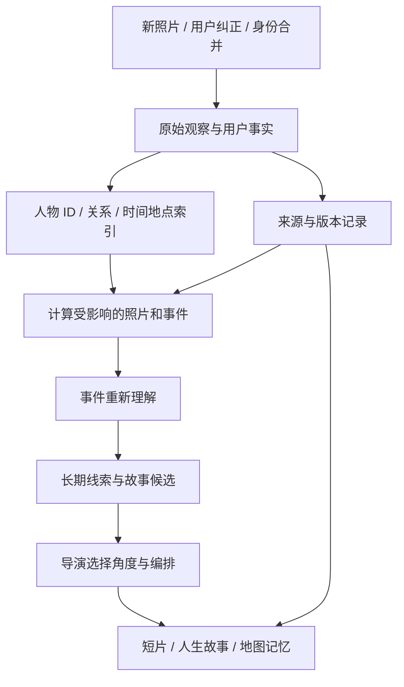

# 持续理解的个人记忆系统：现状、修复与后续架构

日期：2026-09-28。基线：`5dac0d4`。本轮修复与验收随本文件对应的 Git 提交保存。

后续状态：第一轮已提交为 `2e847f6`。同日第二轮已实现事件语义队列、跨事件故事发现与证据复核，接入自动短片；见 [本轮实现](CONTINUOUS_UNDERSTANDING_2026-09-28.md)。下文保留第一轮核查时的判断，“尚未实现”需结合该后续文档阅读。

## 1. 产品目标

照片不断增加，用户不断确认名字、关系、事件。系统应当沿用这些确认，回看旧资料，修正相关解释，并提出新的故事角度。短片、人物页、人生故事、地图只是同一个记忆库的不同表达。

用户明确指出：人物库已经填好的信息，应该由系统解决匹配和传播，不能把“再确认一次某个人，做成某支视频”当成系统维护方案。本轮没有给真实照片手工指定新身份，也没有为某个亲属添加特例。

## 2. 核查到的实际断点

1. **检测缺失**：被讨论的海边照片在原有记录中只有一个人脸观测，第二位人物没有进入匹配程序。人物库有她的名字和关系，不等于检测器已经找到了她在这张照片中的脸。
2. **补检被拦截**：`saveDetection` 原先在照片有任何已确认人物时直接返回，连新增遗漏人脸也无法保存。
3. **确认不触发旧候选复查**：确认名字、合并身份之后，没有立即更新其他未锁定候选与新身份参照的匹配。
4. **关系只是字符串**：原先没有人物 ID 之间的关系记录，也没有以已确认关系为依据的共同经历章节。
5. **故事目前主要靠规则**：地点、时间段、六类活动和人物 ID 派生章节。并不存在持续调用语义模型、回顾冲突和重新解释事件的完整系统。
6. **短片更新覆盖不全**：依赖 `chapterId`，而地点选片只有与章节照片集合完全相等时才绑定；手动从旧片重编还会丢失章节绑定。旧的资料补充只检查最新一条短片。
7. **影片是版本快照**：已经输出的 MP4 不会因为改了人物名字而自行改变。应该生成有来源的新版本，并标明旧片使用旧资料。

## 3. 本轮已经实现

### 3.1 检测与身份匹配

- 检测和特征模型分开版本化：保留已有 YuNet/SFace 特征空间指纹，新增 `detectorRevision` 与 `detection_runs`。补检不属于特征模型迁移。
- YuNet 从单个 960 像素视图扩展到全图 960 / 1600 和四个重叠局部视图；将坐标和五官关键点还原到原片，再做重叠去重。检测阈值没有降低。
- 每张照片每个检测版本只补检一次；原图仍由登录相册提供，处理后移除临时输入。
- 补检按几何重叠对齐已有观测，保留已有 face ID、人物 ID、用户确认、拆分和忽略；对未锁定候选更新特征并添加新发现的人脸。不能因为原图里一个人已经确认，就忽略另一个人。
- 人物确认、合并、拆分后立即复查未锁定候选；已有自动匹配也会重新核对，撤回旧参照后不继续沿用失去依据的关联。用户锁定的确认不被重组覆盖。仍保留相似度、组内一致性、同图互斥和模型一致性要求。
- 修改名字或小事实不重新提取整本相册的人脸特征。

**真实运行结果**：登录相册已自动完成 62 张照片的新版补检，人脸观测从 83 增至 89，原有四位已确认人物保留。被讨论的海边照片仍只有原来那一个观测；该照片第二位人物的漏检尚未解决。新增 6 条观测不是“新增 6 个人”，也不能据此宣称识别率提高了某个百分比。

当前改进提供了再次检测和匹配的通路，但尚未证明 YuNet/SFace 可以覆盖所有侧脸、小脸、遮挡。下一项身份工作应当用漏检/未匹配清单比较检测器和特征引擎，而不是降低阈值或继续让用户重复命名。参考项目使用 InsightFace/buffalo_l；本项目目前没有安装该引擎，不能描述为已经迁移完成。

### 3.2 稳定的人物关系

- 从用户填写的、明确引用唯一已命名人物的关系提取有向关系，例如“团团的姥姥”。不从年龄、外貌或同框推断亲属。
- 关系绑定稳定 subject/object ID；后来只改昵称时，关系保留，文案使用新昵称。
- 用户改动关系说明时重新解析；无法明确解释的自由文字仍保留在人物资料里，不强行生成关系边。
- 命名歧义不自动绑定；合并、撤销同步维护既有绑定。
- 双方分别被确认出现在照片中时，可形成共同经历章节。关系本身是长期事实；某张照片里谁在场是另一条证据，不能互相代替。
- 人生管家上下文和短片都接收结构化关系。已经支持“姥姥/外婆/祖孙”等有明确依据的自然表达，避免旧的逐字校验错误清掉合法文案。

### 3.3 故事到短片的资料依赖

- 每支短片记录 `knowledgeRevision`，比较实际照片描述、日期、事件确认、人物与适用补充。
- 这项比较不依赖章节绑定，旧版尚无字段的影片使用存档输入计算基线。
- 人脸框微调、任务时间戳、内部 revision 的变化不单独触发重剪。
- 从旧片重编保留 chapter ID，记录 lineage / supersedes；同一故事已产生最新版后，旧版本不会继续触发重编循环。
- 新版本重新读取人物库和照片描述，不重复使用旧片缓存中的旧名字、旧信息卡。
- 人物资料变化会刷新短片状态。自动开启时合并连续修改，等待约 20 秒再重编；暂停覆盖这条队列。旧片显示资料已更新的提示。
- 如果编排/上传期间事实改变，开始渲染前重新编排，旧的异步结果不能直接当成最新资料交付。
- 当前浏览器仍负责上传所选照片；关闭相册时不能凭空读取其 IndexedDB。

**边界**：上述自动检查覆盖服务保留的影片任务。预览仍是最近 8 个、24 小时；长期导出文件不会自动改写。持久化的全历史作品依赖登记，以及已过期作品的自动修订，仍须单独开发。

## 4. 推荐的完整核心架构（设计，尚未全部实现）

### 4.1 数据分层

| 层 | 保存什么 | 更新方式 |
| --- | --- | --- |
| 原始观察 | 原图引用、EXIF、单图可见动作和物品、检测结果 | 新图/模型版本/观察纠正时增量处理 |
| 已确认知识 | 人物稳定 ID、用户关系、用户事实、被纠正的事件 | 用户输入优先；保留修改与撤回记录 |
| 事件理解 | 谁在什么范围内做了什么、互动证据、冲突、缺失信息 | 受影响事件重新推理，保留证据 ID |
| 长期脉络 | 人物之间的陪伴、跨地点活动、重访、可核实的变化 | 新事件或关键事实触发，回看相关旧事件 |
| 创意与成品 | 主题、角度、镜头组织、字幕、音乐结构、作品版本 | 事实变化更新相关作品；新候选满足价值门槛再制作 |

单图原始观察可能写“小男孩”。用户确认她是女儿后，应当更新展示用的解释和故事，不抹掉原始观察的来源，也不要求重新上传所有照片才能纠正称呼。

### 4.2 持续分析的触发条件

| 变化 | 必须处理 | 不需要处理 |
| --- | --- | --- |
| 只改昵称 | 显示、相关文案、人物引用版本 | 人脸向量重新提取 |
| 确认/合并/拆分人物 | 复查旧候选、事件成员、关系和故事依赖 | 无关人物、无关地点的全部图像 |
| 新图加入一次既有出游 | 分析新图，重估对应事件完整性，寻找新互动证据 | 所有历史事件 |
| 新关系或事件纠正 | 重解释相关事件、长期脉络和作品 | 重新识别无关照片 |
| 新检测器/特征模型 | 受控补检或显式特征迁移，保留确认 | 将不同模型向量直接混比 |
| 同一人物积累新月份 | 寻找可证实的活动变化/重访/共同经历 | 自动宣称长高、第一次或新的性格 |

系统空闲回看可发现过去没有足够证据的故事；回看必须有新证据、索引版本或尚未解决的问题。没有新输入时，不持续用自己的摘要再次证明自己。

### 4.3 异步编排契约

建议持久化 `knowledge_changes`、`analysis_jobs`、`story_revisions`、`artifact_dependencies`：

1. 一次事实事务产生 change record，包含 changed entity/fact IDs。
2. 依赖索引确定受影响的事件和章节。合并连续修改，给这一批生成不可变输入快照。
3. 工作队列依次运行身份复查、事件分析、长期线索发现。任务 key 包含范围、输入内容哈希、模型和 skill 版本。
4. 模型输出必须引用已有 evidence IDs；新增解释保留为推断。没有证据的关系、里程碑或偏好不进入确认事实。
5. 发布前比较输入 revision；期间又改了人物，旧结果标为过期并丢弃，不能覆盖新解释。
6. 同一输入只运行一次，加一次有界结构修复；失败保留原因、退避和重试入口。
7. 重做文字分析比渲染 MP4 便宜，允许先更新故事预览；新作品满足明确事实变化或新的创意价值时再渲染。
8. 长期作品登记保留来源和历史版本，不能只依赖 24 小时视频缓存。

这些队列、语义分析任务、依赖索引和跨事件模型解释**尚未完整实现**。本轮的规则章节修复与资料指纹是基础，不能称为“动态人生理解已全部完成”。

### 4.4 什么才是更好的故事理解

同一批照片可以逐步从“海边有人玩沙”发展到“已确认的两人一起出游”，再在多次有证据的共同经历中提出“这些日子里的陪伴”。新增关系主要改变解释角度，不应改写谁出现在某张照片中。

两种反例必须避免：

- 多次拿着甜筒不等于“最爱冰淇淋”；可以陈述多次被拍到的实际活动。
- 已知某人是姥姥，不等于把同区域每位老人都当作她；先解决照片成员证据。

## 5. 甜筒拼贴与持续创意

用户的理解是对的：甜筒篇章用共同物品/活动跨地点串联照片，不再只围绕一个景点。当前主题发现仍是少量显式规则：雪地、甜筒、手工；图谱还另含海边、阅读和户外活动规则。不能说系统已经能自由发现任何主题。

建议下一版导演接收四项独立输入：

1. **发生了什么**：事件事实和人物证据。
2. **为什么值得讲**：陪伴、重复出现的活动、特别的细节、可核实的变化。
3. **从什么角度讲**：同一物品跨月份、同一动作由不同家人陪伴、同地重访、手上细节的小合集。
4. **如何表达**：纪实、拼贴、手账、并置回看、安静留白；由内容选择节奏、构图和音乐。

故事候选需要比较照片重合率、近期主题、已用版式、音乐节奏和叙事角度。同一批素材不应只换标题/BGM就反复发布；有新事实或不同的叙事价值才成为新的作品。新创意不得回流成为事实来源。

## 6. 任意地点达到稳定美术品质的路线

目前 skill 是可复用制作与验收流程；通用场景已经自动化，专属地标仍需要参考资料和资产制作。不能保证任意无资料地点都自动生成同等可辨认的专属建筑。

要达到目标，需要建设可执行的资产生产流程：

1. **解析地点实体**：把同一园区/商场的多个照片组归入同一真实场地，保留原照片位置。收集足迹、高度、道路、水系、绿地和可用参考图。
2. **统一美术规范**：固定树型、草坪、楼体丰满比例、材质、光照、水色、阴影、线条；变化只开放必要参数。
3. **按类别生成**：住宅、商场、场馆、校园、公园、海岸等有各自的可组合模板。普通元素复用；关键地标提取辨识轮廓、屋顶和立面特征，生成或检索专属资产。
4. **构建与验收**：在真实地图坐标上输出中景、近景、多方向视图，检查轮廓相似、资料覆盖、湖河保留、穿插遮挡、风格一致和性能。
5. **有界修复**：不合格结果回到具体步骤修正；缺资料保持待补状态，不能铺地板盖掉真实建筑或用装饰冒充完成。
6. **缓存和复用**：通过验收的资产按地点/建筑 ID 和风格版本缓存；展示时按距离简化，导入新照片先查已有地点和资产。

通用元素的风格一致性、特殊建筑辨识度、地理完整性、运行性能应分别验收。把所有区域标成 ready，或让所有建筑同色，不能证明四项都达标。

现有 Three.js 继续展示，新增离线/后台资产生产与质量验收能力。规则建模可参考 [Esri CGA](https://doc.arcgis.com/en/cityengine/latest/get-started/get-started-rule-based-modeling.htm)；单图生成带材质资产可评估 [Microsoft TRELLIS.2](https://github.com/microsoft/TRELLIS.2)。这些是技术候选，不是本项目已经集成的能力；单图生成不提供完整地理依据，也不自动保证任意地标准确。

## 7. 验收与后续优先级

本轮自动化验证：

- `node --experimental-strip-types --test tests/identity-graph.mjs tests/film-knowledge.mjs`：15 项通过。覆盖补检保留确认、旧候选复查、撤回身份参照后的关联修订、关系改名/撤回、限定照片证据、无章节影片更新、旧版本不循环、上传期间资料变化。
- `node --experimental-strip-types --test skills/memory-film/test.mjs tests/film-stories.mjs tests/film-export.mjs`：12 项通过。
- `node tests/memory-library.mjs`：真实页面和真实测试人物库，桌面/手机、确认到章节到影片请求通过，无页面错误。
- `npm run build`：通过，原有大 bundle 提示仍存在。
- `node tests/memory-film.mjs`：通过。隔离测试账户/插画、模拟 StepFun、真实浏览器和 FFmpeg；自动生成 8 张照片的 45 秒 MP4，补充事实后自动重编、刷新不重复成片、暂停和账户隔离均通过，无页面错误。此测试不代表真实海边照片的身份漏检已解决。

接下来应按以下顺序推进：

1. 人物自动补全的检测与匹配评估，解决剩余漏检，完善可观察的失效原因；保留已有确认和明确迁移策略。
2. 持久化变更队列与依赖索引，串起全历史资料及作品。
3. 事件级语义重理解：新事实如何改变一次经历的解释，而不只改标题。
4. 长期线索发现与创意候选评选，加入多样性和事实核验。
5. 任意地点的资产生产和美术验收服务，沿用既有地图渲染与已验收资产。

优先级依据是用户提出的项目核心：系统持续理解一个人的生活，所有输出共享这份理解。
