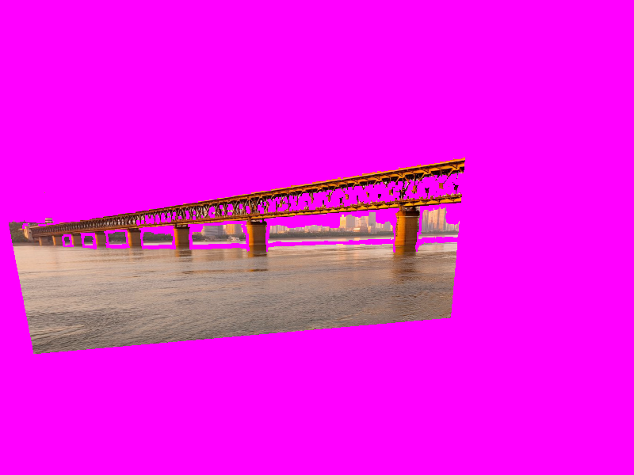
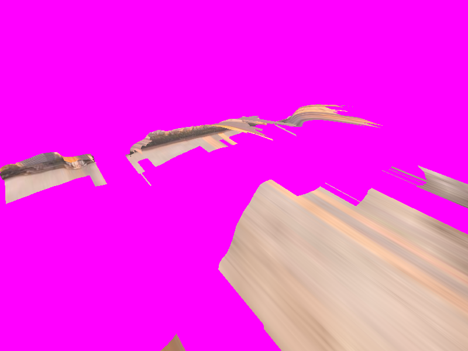
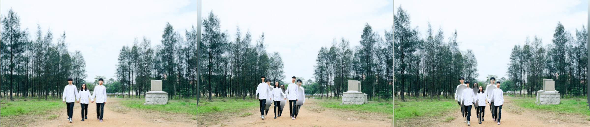

# 用 / 不用 skill：同一份浮雕，两种看法

同一张照片（`images/bridge.jpg`，AI 生成的虚构示例）在本机 ComfyUI + Depth Anything 3 上真实重建一次，分别用两种查看方式渲染，再和原照片比较。`node run-eval.mjs` 可复现（需要本机 ComfyUI）。

- **不用 skill**：最初的查看器。绕包围盒中心转，最大方位 0.4 rad、俯仰 0.3 rad，可拉近到 0.5 倍；视场角靠网格范围猜；后面没有东西。
- **用 skill**：`SpacetimeScene.tsx` 现在的做法（`run-eval.mjs` 直接读源码里的常量）。相机留在原点，视场角来自 DA3 内参，最大方位 0.03 rad、俯仰 0.02 rad（约 1.7° 和 1.1°），不缩放，后面垫着对齐的原照片。

| 指标（4:3 画面） | 不用 skill | 用 skill |
| --- | --- | --- |
| 首视图与原照片的平均像素差（0–255，越小越忠实） | 101.3 | **11.3** |
| 最大摆动时画面里"什么都没有"的比例（四个角取最差） | 74.0 % | **0 %** |

| | 首视图 | 最大摆动 |
| --- | --- | --- |
| 不用 skill |  |  |
| 用 skill |  |  |

洋红色是"空"。旧查看器缩成一小块、拉近后撕成条带和碎片；新查看器首视图与原照片几乎一致，摆到最大角度时撕开处露出的是原照片。

**评分先核对了失败样例**：旧查看器就是已知的坏样本，脚本要求它被判为不合格、新查看器合格，否则报错（阈值：首视图差 < 25，且空白 < 2 %）。

## 前景有人的照片（人物"割裂"）

用户反馈：前景有人的照片一摆动，人物就"割裂"——脚被拉长贴到地面上，旁边多出一个清晰的人。用 `images/people-park.jpg`（AI 生成，三个人牵手走在土路上）复现，修复前后的现象：

- 修复前：摆动约 7° 时，人物脚下拉出长长的黑影（连接人与身后地面的拉伸面），垫底的清晰原照片在撕开处露出第二组人物。
- 修复后（下图，左到右：首视图、最大摆动向左、最大摆动向右）：首视图与原照片一致；人物完整，没有被拉长的脚和清晰的重影；最大摆动时人物旁边只留一条柔和的补色。做法：剔掉沿视线的拉伸三角形、压缩深度范围、垫底照片里补掉被遮住的部分、摆动收到约 1.7°。

上面的数值对比（`run-eval.mjs`）只覆盖相机策略与对齐的垫底照片；网格清理和补洞由 `../../test.mjs` 里的单元测试覆盖，人物照片的效果由 `SPACETIME_PHOTO=… node tests/spacetime-scene.mjs` 的截图核对。

## 仍然存在的问题

- 单目深度是相对的：水面、地面的远近关系不准（早期版本最大摆动时桥墩前的水面会鼓成一个缓坡），被遮住的部分单张照片也补不出来。这是"单张浮雕"的固有限制，所以摆动范围不能放宽；要真实的场景只能走多视角重建。
- 比较用的是渲染策略，不是 React 组件本身；组件的行为由 `test.mjs` 的代码检查和 `tests/spacetime-scene.mjs` 的浏览器截图覆盖。
